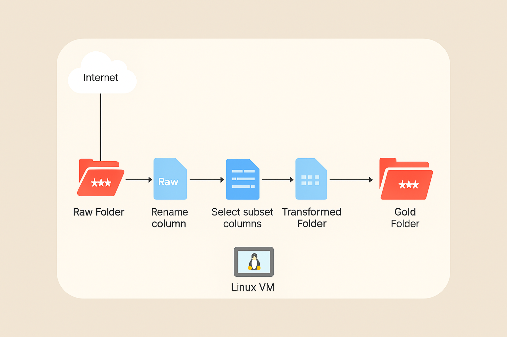

# Linux ETL Assignment  

This project demonstrates the implementation of a simple **ETL (Extract, Transform, Load) pipeline** and related automation tasks using **Bash scripting** on a Linux environment.  
The assignment also covers scheduling jobs with **cron**, organizing data files, and loading competitor data into a **PostgreSQL database** for analysis.  
All tasks are documented and structured to reflect real-world data engineering practices.  

---

## ETL Architecture  
  

## Documentation  

### **Task 1: ETL Script**  
The Bash script for this task can be found [here](./bash_scripts/etl.sh).  
The dataset URL is stored inside a `.env` file for easy reference.  

#### **Extract Phase**  
- A `raw` directory is created to store the downloaded file.  
- The script checks if the file already exists; if not, it downloads it.  
- If the file is present, the script exits gracefully.  

#### **Transform Phase**  
- A `transformed` directory is created if missing.  
- The script uses the `sed` command to rename the column `Variable_code` → `variable_code`.  
- With `awk`, only four columns are kept: `year`, `Value`, `Units`, `variable_code`.  
- The transformed dataset is saved as `2023_year_finance.csv` inside the `transformed` folder.  
- Validation ensures the transformation was successful and the file exists.  

#### **Load Phase**  
- A `gold` directory is created if missing.  
- The transformed file is copied into this folder.  
- Checks confirm the file was successfully loaded into the `gold` layer.  

---

### **Task 2: Scheduling with Cron**  
The ETL pipeline is scheduled to run daily at **12:00 AM** using cron jobs.  
- The cron expression used: `0 0 * * *`  
- The script [schedule_etl.sh](./bash_scripts/schedule_etl.sh) dynamically retrieves the ETL script path and appends it to the crontab schedule.  

---

### **Task 3: Moving JSON and CSV Files**  
The script [move_json_and_csv.sh](./bash_scripts/move_json_and_csv.sh):  
- Accepts a source directory containing JSON and CSV files.  
- Creates a destination folder named `json_and_CSV` (if it doesn’t already exist).  
- Moves all `.json` and `.csv` files from the source into the destination folder.  

---

### **Task 4: Parch & Posey Data Loading and Queries**  
The ingestion process for the **Parch & Posey** dataset is handled by [parch_posey_postgres_ingest.sh](./bash_scripts/parch_posey_postgres_ingest.sh).  

- An array stores the URLs for each dataset file.  
- A PostgreSQL database named `posey` is created.  
- Supporting SQL files are located in [sql_scripts](./sql_scripts/):  
  - `create_database.sql` → sets up the `posey` database  
  - `create_schema.sql` → creates the schema inside PostgreSQL  
  - `ddl_tables.sql` → defines all necessary tables  
- The Bash script iterates through each CSV file, downloads it if missing, and uses the `psql` command to load the data.  

The queries requested by **Manager Ayoola** are written in [sql_answers.sql](./sql_scripts/sql_answers.sql) with comments for clarity.  
